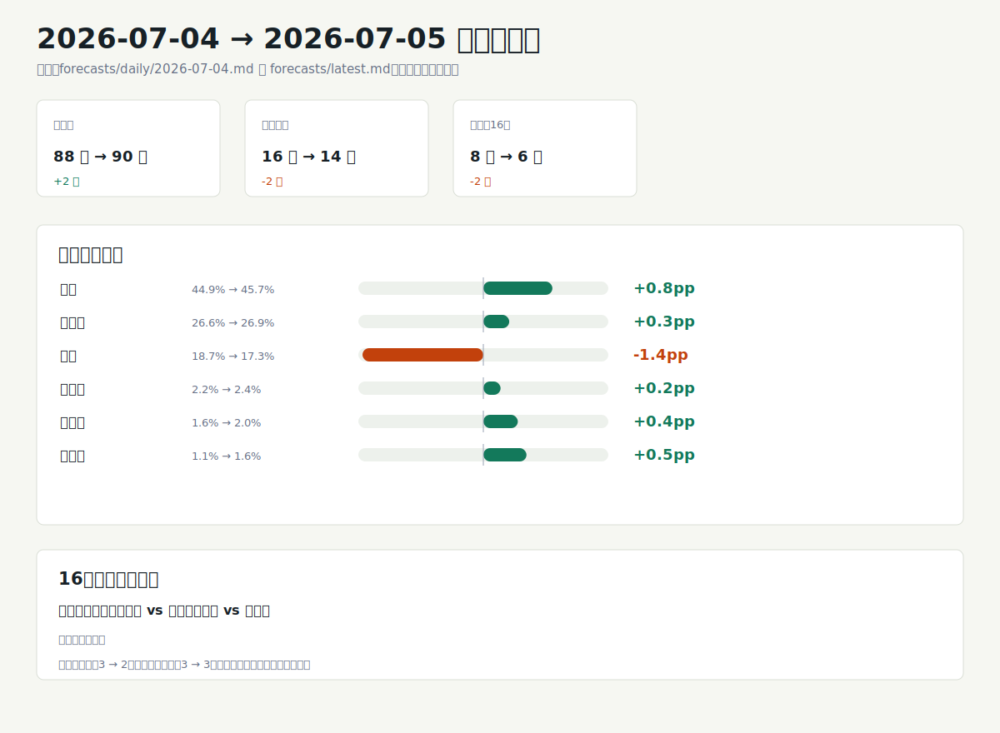

# 世界杯预测模型分析 2026-07-05

## 一句话结论

法国的冠军主线进一步抬升到 `47.7%`，已经明显领先阿根廷的 `29.9%` 和巴西的 `15.2%`。当前 16 强剩余赛程里，阿根廷和巴西是高置信方向；墨西哥对英格兰、美国对比利时、瑞士对哥伦比亚仍是低置信接近盘。市场信号未配置，因此这是一份基于公开赛事数据和公开评分的模型解读，不是赔率判断。

## 图形摘要

## 今日关键判断

- 冠军概率呈三队核心结构：法国 `47.7%` 居首，阿根廷 `29.9%` 第二，巴西 `15.2%` 第三，其余球队都低于 `3%`。
- 最可能冠亚季军组合继续围绕法国、阿根廷、巴西展开，前三个组合分别为 `11.6%`、`10.4%`、`10.3%`。
- 巴西胜挪威 `88.3%`、阿根廷胜埃及 `94.9%` 是本期 16 强表里仅有的高置信方向。
- 西班牙对葡萄牙的晋级概率为 `66.8%`，属于中等优势；葡萄牙仍有足够的模型反向空间。
- 墨西哥胜英格兰 `51.4%`、比利时胜美国 `51.9%`、瑞士胜哥伦比亚 `52.5%` 都接近五五开，不适合下单边强结论。
- 当前日报市场来源为“无”，公开评分来源为 `World Football Elo Ratings`；本分析不补充外部伤病、阵容或赔率信息。

## 重点比赛

| 日期 | 对阵 | 模型方向 | 概率 | 置信度 | 解读 |
| --- | --- | --- | --- | --- | --- |
| 2026-07-05 | 巴西 vs 挪威 | 巴西 | 88.3% | 高 | 巴西优势清晰，是剩余 16 强里最稳的两条方向之一。 |
| 2026-07-05 | 墨西哥 vs 英格兰 | 墨西哥 | 51.4% | 低 | 只比五五开略高，模型没有给出可靠单边倾向。 |
| 2026-07-06 | 葡萄牙 vs 西班牙 | 西班牙 | 66.8% | 中 | 西班牙是更强方向，但还不到高置信区间。 |
| 2026-07-06 | 美国 vs 比利时 | 比利时 | 51.9% | 低 | 本期方向从美国侧转向比利时侧，但幅度仍很小。 |
| 2026-07-07 | 阿根廷 vs 埃及 | 阿根廷 | 94.9% | 高 | 阿根廷晋级概率最高，是法国之外最稳的冠军竞争线。 |
| 2026-07-07 | 瑞士 vs 哥伦比亚 | 瑞士 | 52.5% | 低 | 瑞士只是轻微领先，比赛仍应按接近盘处理。 |

## 冠军与四强路径

法国不仅冠军概率最高，亚军概率也有 `31.1%`，说明它在模拟中反复进入决赛，是当前路径最集中的球队。阿根廷的冠军概率为 `29.9%`，亚军概率为 `25.3%`，仍是主要挑战者；巴西冠军概率降到 `15.2%`，但第三名概率以 `28.0%` 居首，说明它更常落在深轮次但未必最终夺冠的位置。

四强尾部更分散：西班牙冠军概率仅 `2.8%`，但第三名 `13.2%`、第四名 `23.6%`，更像稳定的半决赛竞争者；比利时、葡萄牙、美国在第四名表中分别为 `13.8%`、`11.7%`、`11.3%`，但冠军空间很小。按最可能冠亚季军组合看，法国、阿根廷、巴西三队仍是主轴，西班牙和英格兰主要是改变三四名排序的外圈变量。

## 和上一期相比

与 `2026-07-04` 日报相比，已完赛场次从 `88` 增至 `90`，剩余场次从 `16` 降至 `14`，待预测 16 强比赛从 `8` 场降至 `6` 场；`巴拉圭 vs 法国` 和 `加拿大 vs 摩洛哥` 已从待预测队列移除。生成的变化图概括了三件事：赛程队列减少，冠军概率集中度提高，以及高置信待预测场次从 `3` 场降到 `2` 场，低置信接近盘仍为 `3` 场。

冠军概率变化上，法国从 `44.9%` 升至 `47.7%`，阿根廷从 `26.6%` 升至 `29.9%`，巴西从 `18.7%` 降至 `15.2%`。剩余对阵中，巴西对挪威从 `86.3%` 升至 `88.3%`，阿根廷对埃及从 `90.7%` 升至 `94.9%`；美国对比利时从美国 `53.3%` 变为比利时 `51.9%`，但仍属于低置信翻转。

## 数据与方法限制

- 本分析只使用 `forecasts/latest.md`、最近日报、仓库方法说明和生成脚本输出，不引入新闻、伤病、盘口或阵容推断。
- 基础日报显示市场信号未配置，下一轮和最终预测的市场来源均为“无”，因此没有赔率或预测市场校准层。
- 当前日报公开评分来源为 `World Football Elo Ratings`；上一期部分预测表里公开评分来源为“无”，这里仅按可见日报字段描述，不把它解释为错误。
- 模型是透明启发式加蒙特卡洛模拟，概率是方向性预测，不是结果保证，也不是投注建议。
