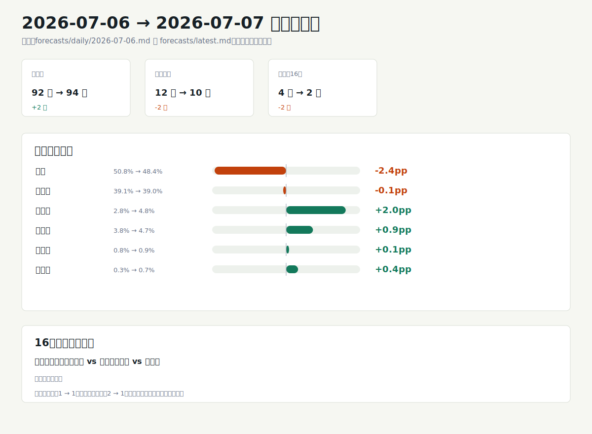

# 世界杯预测模型分析 2026-07-07

## 一句话结论
法国仍是模型冠军主线，冠军概率为 48.4%，但比上一期回落 2.4 个百分点；阿根廷以 39.0% 紧追，两队合计 87.4%，冠军竞争高度集中。7 月 7 日剩余两场 16 强预测分化明显：阿根廷对埃及是高置信方向，瑞士对哥伦比亚是低置信接近盘。市场信号未配置，因此以下判断只解释公开数据和启发式模拟，不加入赔率校准。

## 图形摘要

## 今日关键判断

- 冠军概率的第一层仍是法国 48.4% 与阿根廷 39.0%，其余球队单队最高只有西班牙 4.8% 和英格兰 4.7%。
- 法国领先阿根廷 9.4 个百分点，优势仍明显，但领先幅度较上一期收窄，说明冠军主线没有扩大。
- 西班牙和英格兰的冠军概率不高，但在第三名、第四名边际表中占比突出，是四强路径里的主要竞争者。
- 下一轮预测只剩 2 场：阿根廷 94.9% 对埃及 5.1% 是明确方向，瑞士 52.5% 对哥伦比亚 47.5% 是主要不确定点。
- 当前报告显示已完赛 94 场、剩余 10 场，16 强待预测队列从上一期的 4 场缩至 2 场。
- 市场来源为“无”，置信度只反映公开评分、当前赛果和模拟结构，不代表市场赔率共识。

## 重点比赛

| 日期 | 比赛 | 模型概率 | 主要判断 | 置信 |
| --- | --- | --- | --- | --- |
| 2026-07-07 | 阿根廷 vs 埃及 | 阿根廷 94.9% / 埃及 5.1% | 阿根廷优势极大，爆冷风险低 | 高 |
| 2026-07-07 | 瑞士 vs 哥伦比亚 | 瑞士 52.5% / 哥伦比亚 47.5% | 瑞士仅微弱领先，胜负接近 | 低 |

## 冠军与四强路径

最终预测表给出的冠军排序是法国 48.4%、阿根廷 39.0%、西班牙 4.8%、英格兰 4.7%。这意味着模型的冠军叙事仍主要围绕法国和阿根廷展开，西班牙、英格兰更像是四强和领奖台路径里的主要挑战者，而不是同一量级的冠军热门。

最可能冠亚季军组合也支持这个判断：法国-阿根廷-西班牙为 11.6%，法国-阿根廷-英格兰为 10.3%，阿根廷-法国-西班牙为 10.1%，阿根廷-法国-英格兰为 8.7%。边际名次上，西班牙第三名概率 29.7%、英格兰第三名概率 24.2%；第四名表中英格兰 26.1%、西班牙 24.3%、挪威 17.9%、比利时 16.7%，显示四强后段比冠军席位更开放。

## 和上一期相比

生成的变化图比较了 `forecasts/daily/2026-07-06.md` 与 `forecasts/latest.md`。核心变化是赛程推进：已完赛场次从 92 场增至 94 场，剩余场次从 12 场降至 10 场，16 强待预测场次从 4 场降至 2 场。

| 指标 | 上一期 | 本期 | 变化 |
| --- | --- | --- | --- |
| 已完赛场次 | 92 | 94 | +2 |
| 剩余场次 | 12 | 10 | -2 |
| 待预测 16 强场次 | 4 | 2 | -2 |
| 高置信场次 | 1 | 1 | 0 |
| 低置信接近盘 | 2 | 1 | -1 |

冠军概率变化上，法国从 50.8% 降至 48.4%，阿根廷从 39.1% 微降至 39.0%；西班牙从 2.8% 升至 4.8%，英格兰从 3.8% 升至 4.7%。图中“从预测表移除”的葡萄牙 vs 西班牙、美国 vs 比利时只表示它们不再出现在当前待预测表中；本分析不补写比分或赛事情节。

## 数据与方法限制

本期公开评分来源为 World Football Elo Ratings；FIFA 排名和 FIFA 积分列在基础报告中为空，因此不推断未展示的官方排名信号。市场信号显示“未配置”，下一轮与最终预测表中的市场来源均为“无”，所以本分析没有使用赔率、盘口、成交量或预测市场价格。

最终排名来自 5000 次蒙特卡洛模拟，随机种子为 20260707；模型是透明启发式评分加剩余赛程模拟，不是训练型投注模型。16 强比赛没有平局晋级结果，表中平局概率为 0.0% 是赛制处理，不表示常规时间无平局风险。本报告只作方向性分析，不是投注建议。
