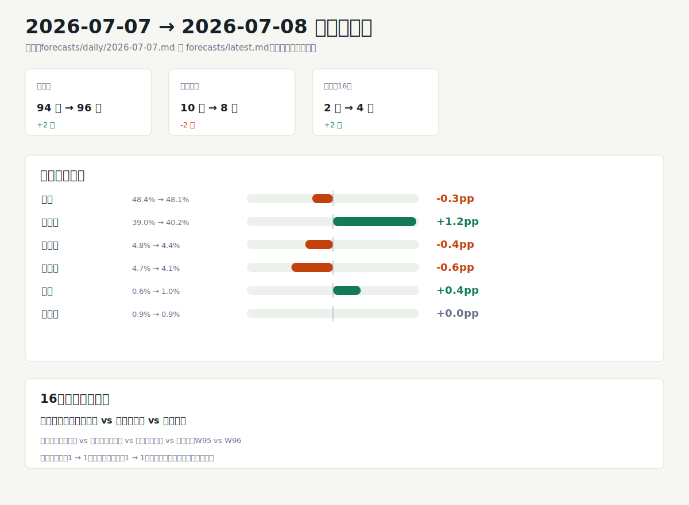

# 世界杯预测模型分析 2026-07-08

## 一句话结论
法国仍是冠军第一主线，冠军概率 48.1%，但阿根廷升至 40.2%，两队合计 88.3%，冠军竞争比“四强席位”更集中。四分之一决赛已有概率的三场里，法国对摩洛哥是唯一高置信方向，西班牙对比利时、英格兰对挪威都属于中等优势。市场信号未配置，因此以下判断只解释公开评分、当前赛果和蒙特卡洛模拟，不加入赔率校准。

## 图形摘要

## 今日关键判断

- 冠军概率第一层仍是法国 48.1% 与阿根廷 40.2%；其余球队中西班牙 4.4%、英格兰 4.1%，与前两名明显断层。
- 法国领先阿根廷 7.9 个百分点，领先仍清楚，但相较上一期的 9.4 个百分点继续收窄。
- 四强后段更开放：第三名概率最高的是西班牙 28.2% 和英格兰 26.7%，第四名概率最高的是英格兰 26.2%、西班牙 24.4%、比利时 18.5%、挪威 18.3%。
- 下一轮已进入 Quarter-final；当前表中法国 90.0% 对摩洛哥 10.0% 是高置信方向，西班牙 67.1% 对比利时 32.9%、英格兰 68.9% 对挪威 31.1% 是中等置信。
- `W95` vs `W96` 仍是占位未解析，基础报告没有给出球队或概率，本分析不补写对阵、比分或晋级来源。
- 市场来源为“无”，置信度只来自公开评分与模型结构，不代表市场赔率共识。

## 重点比赛

| 日期 | 比赛 | 模型概率 | 主要判断 | 置信 |
| --- | --- | --- | --- | --- |
| 2026-07-09 | 法国 vs 摩洛哥 | 法国 90.0% / 摩洛哥 10.0% | 法国优势极大，是本轮最明确方向 | 高 |
| 2026-07-10 | 西班牙 vs 比利时 | 西班牙 67.1% / 比利时 32.9% | 西班牙占优，但比利时仍有可见晋级空间 | 中 |
| 2026-07-11 | 挪威 vs 英格兰 | 挪威 31.1% / 英格兰 68.9% | 英格兰优势接近七成，仍不是锁定盘 | 中 |
| 2026-07-11 | W95 vs W96 | 未给出 | 占位未解析，只能作为赛程风险处理 | 低 |

## 冠军与四强路径

最终预测表给出的冠军排序是法国 48.1%、阿根廷 40.2%、西班牙 4.4%、英格兰 4.1%。模型解释上，法国仍是最可能冠军，但阿根廷已经把差距压到 7.9 个百分点；西班牙和英格兰更像是四强及领奖台路径中的主要挑战者，而不是同一档冠军热门。

最可能冠亚季军组合也显示决赛路径高度集中：法国-阿根廷-西班牙为 12.0%，法国-阿根廷-英格兰为 11.0%，阿根廷-法国-西班牙为 9.8%，阿根廷-法国-英格兰为 9.6%。边际名次上，西班牙和英格兰在第三名、第四名表中占比突出；比利时和挪威的冠军概率低，但第四名概率分别有 18.5% 和 18.3%，说明它们更像四强后段扰动项。

## 和上一期相比

生成的变化图比较了 `forecasts/daily/2026-07-07.md` 与 `forecasts/latest.md`。核心变化是赛程推进到四分之一决赛：已完赛场次从 94 场增至 96 场，剩余场次从 10 场降至 8 场；当前下一轮预测表从上一期的 2 条 16 强对阵变为 4 条四分之一决赛行，其中 1 条仍是 `W95` vs `W96` 占位。

| 指标 | 上一期 | 本期 | 变化 |
| --- | --- | --- | --- |
| 已完赛场次 | 94 | 96 | +2 |
| 剩余场次 | 10 | 8 | -2 |
| 下一轮未赛轮次 | Round of 16 | Quarter-final | 轮次推进 |
| 当前预测表行数 | 2 | 4 | +2 |
| 已给出概率的高置信场次 | 1 | 1 | 0 |
| 已给出概率的低置信接近盘 | 1 | 0 | -1 |

冠军概率上，法国从 48.4% 小降至 48.1%，阿根廷从 39.0% 升至 40.2%，两队合计从 87.4% 升至 88.3%；西班牙从 4.8% 降至 4.4%，英格兰从 4.7% 降至 4.1%。图中“从预测表移除”的阿根廷 vs 埃及、瑞士 vs 哥伦比亚只表示它们不再出现在当前待预测表中；图中“新增待预测”的法国 vs 摩洛哥、西班牙 vs 比利时、挪威 vs 英格兰、W95 vs W96 来自本期下一轮预测表，本分析不补写缺失事实。

## 数据与方法限制

本期公开评分来源为 World Football Elo Ratings；FIFA 排名和 FIFA 积分列在基础报告中为空，因此不推断未展示的官方排名信号。市场信号显示“未配置”，下一轮与最终预测表中的市场来源均为“无”，所以本分析没有使用赔率、盘口、成交量、流动性或预测市场价格。

最终排名来自 5000 次蒙特卡洛模拟，随机种子为 20260708；模型是透明启发式评分加剩余赛程模拟，不是训练型投注模型。四分之一决赛预测表没有平局晋级结果，表中平局概率为 0.0% 是赛制处理，不表示常规时间无平局风险。本报告只作方向性分析，不是投注建议。
