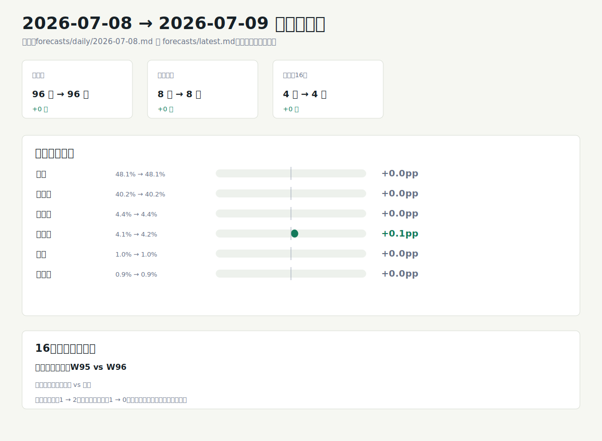

# 世界杯预测模型分析 2026-07-09

## 一句话结论
法国仍是冠军第一主线，冠军概率 48.1%，但阿根廷保持在 40.2%，两队合计 88.3%，冠军争夺继续高度集中。与上一期相比，冠军概率几乎没有重排，真正的变化是四分之一决赛占位补全：阿根廷 vs 瑞士进入待预测表，并成为第二个高置信方向。市场信号未配置，因此以下判断只解释公开评分、当前赛果和蒙特卡洛模拟，不加入赔率校准。

## 图形摘要

## 今日关键判断

- 冠军第一层仍是法国 48.1% 与阿根廷 40.2%；西班牙 4.4%、英格兰 4.2% 位于第二层，与前两名差距很大。
- 法国领先阿根廷 7.9 个百分点，领先幅度清楚，但不足以把冠军路径解释为单队锁定。
- 四分之一决赛 4 场都已给出球队和概率；法国 90.0% 对摩洛哥 10.0%、阿根廷 88.1% 对瑞士 11.9% 是本期两个高置信方向。
- 西班牙 67.1% 对比利时 32.9%、英格兰 68.9% 对挪威 31.1% 属于中等置信，优势方明确但仍保留可见爆冷空间。
- 四强后段更开放：第三名概率最高的是西班牙 28.2% 与英格兰 26.7%，第四名概率最高的是英格兰 26.2%、西班牙 24.5%、比利时 18.5%、挪威 18.3%。
- 市场来源为“无”，置信度只来自公开评分与模型结构，不代表市场赔率共识。

## 重点比赛

| 日期 | 比赛 | 模型概率 | 主要判断 | 置信 |
| --- | --- | --- | --- | --- |
| 2026-07-09 | 法国 vs 摩洛哥 | 法国 90.0% / 摩洛哥 10.0% | 法国优势最大，是本轮最明确方向 | 高 |
| 2026-07-10 | 西班牙 vs 比利时 | 西班牙 67.1% / 比利时 32.9% | 西班牙占优，但比利时仍有明显晋级空间 | 中 |
| 2026-07-11 | 挪威 vs 英格兰 | 挪威 31.1% / 英格兰 68.9% | 英格兰接近七成优势，但不是锁定盘 | 中 |
| 2026-07-11 | 阿根廷 vs 瑞士 | 阿根廷 88.1% / 瑞士 11.9% | 阿根廷成为本期新增的高置信晋级方向 | 高 |

## 冠军与四强路径

最终预测表给出的冠军排序是法国 48.1%、阿根廷 40.2%、西班牙 4.4%、英格兰 4.2%。模型解释上，法国仍是最可能冠军，阿根廷是唯一同档追赶者；西班牙和英格兰更像四强及领奖台路径中的主要挑战者，而不是同一档冠军热门。

最可能冠亚季军组合继续集中在法阿双核心路径：法国-阿根廷-西班牙为 12.0%，法国-阿根廷-英格兰为 11.0%，阿根廷-法国-西班牙为 9.8%，阿根廷-法国-英格兰为 9.6%。边际名次上，西班牙和英格兰在第三名、第四名表中占比突出；比利时和挪威的冠军概率低，但第四名概率分别有 18.5% 和 18.3%，说明它们更像四强后段扰动项。

## 和上一期相比

生成的变化图比较了 `forecasts/daily/2026-07-08.md` 与 `forecasts/latest.md`。图中的核心信息是：已完赛场次仍为 96 场，剩余场次仍为 8 场，当前待预测表仍为 4 场；变化集中在预测队列质量，上一期的 `W95` vs `W96` 占位被本期的阿根廷 vs 瑞士替代。

| 指标 | 上一期 | 本期 | 变化 |
| --- | --- | --- | --- |
| 已完赛场次 | 96 | 96 | 0 |
| 剩余场次 | 8 | 8 | 0 |
| 下一轮未赛轮次 | Quarter-final | Quarter-final | 不变 |
| 当前预测表行数 | 4 | 4 | 0 |
| 高置信场次 | 1 | 2 | +1 |
| 低置信接近盘 | 1 | 0 | -1 |

冠军概率几乎稳定：法国 48.1% 不变，阿根廷 40.2% 不变，西班牙 4.4% 不变，英格兰从 4.1% 小升至 4.2%。图中“从预测表移除：W95 vs W96”只表示占位不再出现在当前待预测表中；“新增待预测：阿根廷 vs 瑞士”来自本期下一轮预测表，本分析不补写比分、晋级来源或外部赛事情报。

## 数据与方法限制

本期公开评分来源为 World Football Elo Ratings；FIFA 排名和 FIFA 积分列在基础报告中为空，因此不推断未展示的官方排名信号。市场信号显示“未配置”，下一轮与最终预测表中的市场来源均为“无”，所以本分析没有使用赔率、盘口、成交量、流动性或预测市场价格。

最终排名来自 5000 次蒙特卡洛模拟，随机种子为 20260709；模型是透明启发式评分加剩余赛程模拟，不是训练型投注模型。四分之一决赛预测表没有平局晋级结果，表中平局概率为 0.0% 是赛制处理，不表示常规时间无平局风险。本报告只作方向性分析，不是投注建议。
