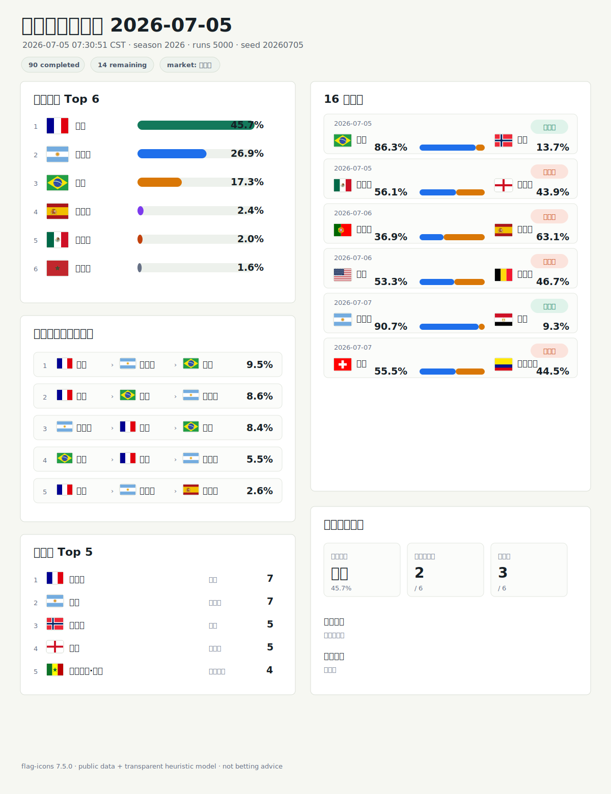

# 世界杯预测日报 2026-07-05

生成时间: 2026-07-05 07:30:51 CST | 赛季: 2026
最终排名模拟次数: 5000 | 随机种子: 20260705 | 市场信号: 未配置

本报告基于公开赛事数据、透明启发式模型和可选赔率/预测市场信号生成，仅作方向性预测，不是投注建议。

## 今日结论

- 冠军主线：法国 以 `45.7%` 排在第一。
- 下一轮：`2` 场是高置信方向，`3` 场是低置信接近盘。
- 市场信号：未配置。

## 可审计明细

### 当前概况

| 项目 | 数值 |
| --- | --- |
| 已完赛场次 | 90 |
| 剩余场次 | 14 |
| 下一轮未赛轮次 | Round of 16 |
| 下一场未赛日期 | 2026-07-05 |

### 射手榜
| 球员 | 球队 | 进球 |
| --- | --- | --- |
| 姆巴佩 | 法国 | 7 |
| 梅西 | 阿根廷 | 7 |
| 哈兰德 | 挪威 | 5 |
| 凯恩 | 英格兰 | 5 |
| 伊斯梅拉·萨尔 | 塞内加尔 | 4 |
| 奥亚萨瓦尔 | 西班牙 | 4 |
| 登贝莱 | 法国 | 4 |
| 维尼修斯 | 巴西 | 4 |
| 布罗贝 | 荷兰 | 3 |
| 加克波 | 荷兰 | 3 |
| C 罗 | 葡萄牙 | 3 |
| 昂达夫 | 德国 | 3 |
| 伊莱贾·贾斯特 | 新西兰 | 3 |
| 巴洛贡 | 美国 | 3 |
| 赛巴里 | 摩洛哥 | 3 |
| 曼赞比 | 瑞士 | 3 |
| 乔纳森·戴维 | 加拿大 | 3 |
| 基尼奥内斯 | 墨西哥 | 3 |
| 哈弗茨 | 德国 | 3 |
| 马特乌斯·库尼亚 | 巴西 | 3 |

### 小组积分榜
#### A 组
| 球队 | 赛 | 分 | 胜 | 平 | 负 | 进 | 失 | 净胜 |
| --- | --- | --- | --- | --- | --- | --- | --- | --- |
| 墨西哥 | 3 | 9 | 3 | 0 | 0 | 6 | 0 | 6 |
| 南非 | 3 | 4 | 1 | 1 | 1 | 2 | 3 | -1 |
| 韩国 | 3 | 3 | 1 | 0 | 2 | 2 | 3 | -1 |
| 捷克 | 3 | 1 | 0 | 1 | 2 | 2 | 6 | -4 |

#### B 组
| 球队 | 赛 | 分 | 胜 | 平 | 负 | 进 | 失 | 净胜 |
| --- | --- | --- | --- | --- | --- | --- | --- | --- |
| 瑞士 | 3 | 7 | 2 | 1 | 0 | 7 | 3 | 4 |
| 加拿大 | 3 | 4 | 1 | 1 | 1 | 8 | 3 | 5 |
| 波黑 | 3 | 4 | 1 | 1 | 1 | 5 | 6 | -1 |
| 卡塔尔 | 3 | 1 | 0 | 1 | 2 | 2 | 10 | -8 |

#### C 组
| 球队 | 赛 | 分 | 胜 | 平 | 负 | 进 | 失 | 净胜 |
| --- | --- | --- | --- | --- | --- | --- | --- | --- |
| 巴西 | 3 | 7 | 2 | 1 | 0 | 7 | 1 | 6 |
| 摩洛哥 | 3 | 7 | 2 | 1 | 0 | 6 | 3 | 3 |
| 苏格兰 | 3 | 3 | 1 | 0 | 2 | 1 | 4 | -3 |
| 海地 | 3 | 0 | 0 | 0 | 3 | 2 | 8 | -6 |

#### D 组
| 球队 | 赛 | 分 | 胜 | 平 | 负 | 进 | 失 | 净胜 |
| --- | --- | --- | --- | --- | --- | --- | --- | --- |
| 美国 | 3 | 6 | 2 | 0 | 1 | 8 | 4 | 4 |
| 澳大利亚 | 3 | 4 | 1 | 1 | 1 | 2 | 2 | 0 |
| 巴拉圭 | 3 | 4 | 1 | 1 | 1 | 2 | 4 | -2 |
| 土耳其 | 3 | 3 | 1 | 0 | 2 | 3 | 5 | -2 |

#### E 组
| 球队 | 赛 | 分 | 胜 | 平 | 负 | 进 | 失 | 净胜 |
| --- | --- | --- | --- | --- | --- | --- | --- | --- |
| 德国 | 3 | 6 | 2 | 0 | 1 | 10 | 4 | 6 |
| 科特迪瓦 | 3 | 6 | 2 | 0 | 1 | 4 | 2 | 2 |
| 厄瓜多尔 | 3 | 4 | 1 | 1 | 1 | 2 | 2 | 0 |
| 库拉索 | 3 | 1 | 0 | 1 | 2 | 1 | 9 | -8 |

#### F 组
| 球队 | 赛 | 分 | 胜 | 平 | 负 | 进 | 失 | 净胜 |
| --- | --- | --- | --- | --- | --- | --- | --- | --- |
| 荷兰 | 3 | 7 | 2 | 1 | 0 | 10 | 4 | 6 |
| 日本 | 3 | 5 | 1 | 2 | 0 | 7 | 3 | 4 |
| 瑞典 | 3 | 4 | 1 | 1 | 1 | 7 | 7 | 0 |
| 突尼斯 | 3 | 0 | 0 | 0 | 3 | 2 | 12 | -10 |

#### G 组
| 球队 | 赛 | 分 | 胜 | 平 | 负 | 进 | 失 | 净胜 |
| --- | --- | --- | --- | --- | --- | --- | --- | --- |
| 比利时 | 3 | 5 | 1 | 2 | 0 | 6 | 2 | 4 |
| 埃及 | 3 | 5 | 1 | 2 | 0 | 5 | 3 | 2 |
| 伊朗 | 3 | 3 | 0 | 3 | 0 | 3 | 3 | 0 |
| 新西兰 | 3 | 1 | 0 | 1 | 2 | 4 | 10 | -6 |

#### H 组
| 球队 | 赛 | 分 | 胜 | 平 | 负 | 进 | 失 | 净胜 |
| --- | --- | --- | --- | --- | --- | --- | --- | --- |
| 西班牙 | 3 | 7 | 2 | 1 | 0 | 5 | 0 | 5 |
| 佛得角 | 3 | 3 | 0 | 3 | 0 | 2 | 2 | 0 |
| 乌拉圭 | 3 | 2 | 0 | 2 | 1 | 3 | 4 | -1 |
| 沙特阿拉伯 | 3 | 2 | 0 | 2 | 1 | 1 | 5 | -4 |

#### I 组
| 球队 | 赛 | 分 | 胜 | 平 | 负 | 进 | 失 | 净胜 |
| --- | --- | --- | --- | --- | --- | --- | --- | --- |
| 法国 | 3 | 9 | 3 | 0 | 0 | 10 | 2 | 8 |
| 挪威 | 3 | 6 | 2 | 0 | 1 | 8 | 7 | 1 |
| 塞内加尔 | 3 | 3 | 1 | 0 | 2 | 8 | 6 | 2 |
| 伊拉克 | 3 | 0 | 0 | 0 | 3 | 1 | 12 | -11 |

#### J 组
| 球队 | 赛 | 分 | 胜 | 平 | 负 | 进 | 失 | 净胜 |
| --- | --- | --- | --- | --- | --- | --- | --- | --- |
| 阿根廷 | 3 | 9 | 3 | 0 | 0 | 8 | 1 | 7 |
| 奥地利 | 3 | 4 | 1 | 1 | 1 | 6 | 6 | 0 |
| 阿尔及利亚 | 3 | 4 | 1 | 1 | 1 | 5 | 7 | -2 |
| 约旦 | 3 | 0 | 0 | 0 | 3 | 3 | 8 | -5 |

#### K 组
| 球队 | 赛 | 分 | 胜 | 平 | 负 | 进 | 失 | 净胜 |
| --- | --- | --- | --- | --- | --- | --- | --- | --- |
| 哥伦比亚 | 3 | 7 | 2 | 1 | 0 | 4 | 1 | 3 |
| 葡萄牙 | 3 | 5 | 1 | 2 | 0 | 6 | 1 | 5 |
| 刚果民主共和国 | 3 | 4 | 1 | 1 | 1 | 4 | 3 | 1 |
| 乌兹别克斯坦 | 3 | 0 | 0 | 0 | 3 | 2 | 11 | -9 |

#### L 组
| 球队 | 赛 | 分 | 胜 | 平 | 负 | 进 | 失 | 净胜 |
| --- | --- | --- | --- | --- | --- | --- | --- | --- |
| 英格兰 | 3 | 7 | 2 | 1 | 0 | 6 | 2 | 4 |
| 克罗地亚 | 3 | 6 | 2 | 0 | 1 | 5 | 5 | 0 |
| 加纳 | 3 | 4 | 1 | 1 | 1 | 2 | 2 | 0 |
| 巴拿马 | 3 | 0 | 0 | 0 | 3 | 0 | 4 | -4 |

### 下一轮预测

| 项目 | 数值 |
| --- | --- |
| 轮次 | Round of 16 |
| 评分来源 | 无 |
| 市场来源 | 无 |

| 日期 | 球队 1 | 球队 2 | 状态 | 球队 1 | 平局 | 球队 2 | 市场信号 |
| --- | --- | --- | --- | --- | --- | --- | --- |
| 2026-07-05 | 巴西 | 挪威 | 预测 | 86.3% | 0.0% | 13.7% | 无 |
| 2026-07-05 | 墨西哥 | 英格兰 | 预测 | 56.1% | 0.0% | 43.9% | 无 |
| 2026-07-06 | 葡萄牙 | 西班牙 | 预测 | 36.9% | 0.0% | 63.1% | 无 |
| 2026-07-06 | 美国 | 比利时 | 预测 | 53.3% | 0.0% | 46.7% | 无 |
| 2026-07-07 | 阿根廷 | 埃及 | 预测 | 90.7% | 0.0% | 9.3% | 无 |
| 2026-07-07 | 瑞士 | 哥伦比亚 | 预测 | 55.5% | 0.0% | 44.5% | 无 |

### 最终预测

| 项目 | 数值 |
| --- | --- |
| 模拟次数 | 5000 |
| 随机种子 | 20260705 |
| 方法 | 透明启发式评分加剩余赛程蒙特卡洛模拟。 |
| 评分来源 | 无 |
| 市场来源 | 无 |

### 最可能冠亚季军组合
| 冠军 | 亚军 | 第三名 | 概率 |
| --- | --- | --- | --- |
| 法国 | 阿根廷 | 巴西 | 9.5% |
| 法国 | 巴西 | 阿根廷 | 8.6% |
| 阿根廷 | 法国 | 巴西 | 8.4% |
| 巴西 | 法国 | 阿根廷 | 5.5% |
| 法国 | 阿根廷 | 西班牙 | 2.6% |
| 法国 | 阿根廷 | 墨西哥 | 2.4% |
| 阿根廷 | 法国 | 西班牙 | 2.1% |
| 法国 | 阿根廷 | 英格兰 | 2.1% |
| 阿根廷 | 法国 | 墨西哥 | 2.0% |
| 法国 | 巴西 | 西班牙 | 1.8% |
| 巴西 | 法国 | 西班牙 | 1.6% |
| 法国 | 墨西哥 | 阿根廷 | 1.6% |

### 冠军
| 球队 | 概率 |
| --- | --- |
| 法国 | 45.7% |
| 阿根廷 | 26.9% |
| 巴西 | 17.3% |
| 西班牙 | 2.4% |
| 墨西哥 | 2.0% |
| 摩洛哥 | 1.6% |
| 英格兰 | 1.0% |
| 美国 | 0.8% |
| 瑞士 | 0.7% |
| 葡萄牙 | 0.6% |
| 比利时 | 0.4% |
| 哥伦比亚 | 0.3% |

### 亚军
| 球队 | 概率 |
| --- | --- |
| 法国 | 29.0% |
| 阿根廷 | 22.4% |
| 巴西 | 16.8% |
| 西班牙 | 5.9% |
| 摩洛哥 | 5.6% |
| 墨西哥 | 4.2% |
| 美国 | 3.3% |
| 比利时 | 2.6% |
| 英格兰 | 2.5% |
| 瑞士 | 2.3% |
| 葡萄牙 | 2.1% |
| 哥伦比亚 | 1.5% |

### 第三名
| 球队 | 概率 |
| --- | --- |
| 巴西 | 24.8% |
| 阿根廷 | 22.3% |
| 西班牙 | 10.4% |
| 法国 | 7.6% |
| 墨西哥 | 6.3% |
| 美国 | 5.4% |
| 英格兰 | 4.4% |
| 葡萄牙 | 4.3% |
| 比利时 | 4.2% |
| 瑞士 | 3.9% |
| 哥伦比亚 | 2.4% |
| 摩洛哥 | 2.2% |

### 第四名
| 球队 | 概率 |
| --- | --- |
| 西班牙 | 18.7% |
| 美国 | 14.6% |
| 比利时 | 13.4% |
| 葡萄牙 | 10.9% |
| 巴西 | 7.5% |
| 阿根廷 | 5.7% |
| 墨西哥 | 4.8% |
| 摩洛哥 | 4.7% |
| 瑞士 | 4.5% |
| 英格兰 | 3.6% |
| 哥伦比亚 | 3.6% |
| 法国 | 3.6% |
